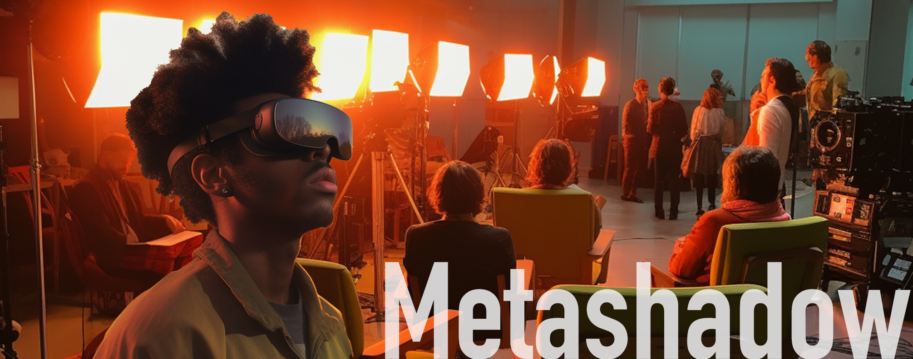

# Feeling Present! From Physical to Virtual Cinematography Lighting Education with Metashadow

The repo contains the source code used to built the prototype system for user study.

## Abstract

The high costs of equipment and limited availability of soundstages for cinematography lighting education present significant challenges for art institutions. Traditional teaching methods that combine basic lighting equipment operation with standard slide courseware often yield unsatisfactory results, hindering students’ mastery of cinematography lighting techniques. To address these issues, we propose Metashadow, a virtual reality (VR) cinematography lighting education system that demonstrates the feasibility of learning in a virtual soundstage. Based on presence theory, Metashadow features high-fidelity lighting devices that enable users to precisely control multiple parameters, offering a more quantifiable approach to learning. We evaluated Metashadow with 24 participants and found that it provides better learning outcomes, flexibility, and creativity than traditional teaching methods. Compared to current mainstream teaching methods, Metashadow imposes a much smaller cost burden and space requirement on education. Our study demonstrates the potential of VR technology to enhance cinematography lighting education and improve students’ learning outcomes.

## Demo
Please find the demo video at `demo.mp4`.

## Note
This repository is currently under construction and is not yet ready for use. We are working hard to improve the code.

If you need access to the source code, please contact Zhang Wei at zwei302@connect.hkust-gz.edu.cn. We appreciate your patience and understanding as we work to make this repository better.